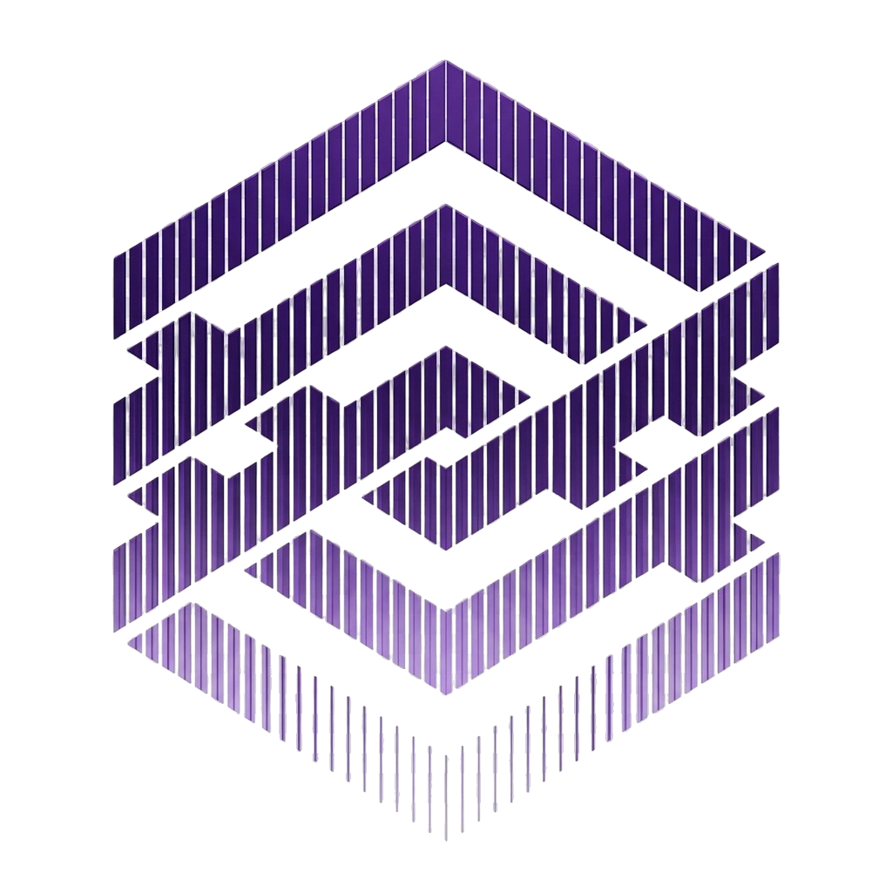
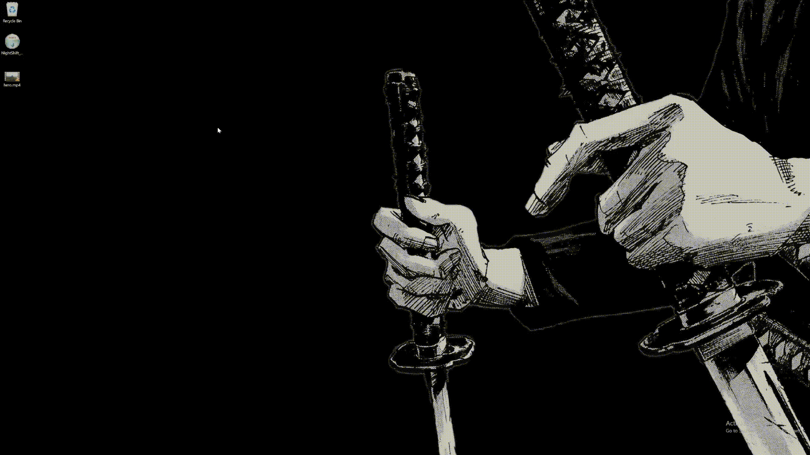

<div align="center">



# ⚡ NIGHTSHIFT

**A desktop workbench for command-line tools.**

Pick the tools you need, run them through visual forms or raw commands, save what you do as templates, and batch it across files.

*Built with Tauri v2, Next.js, Redux Toolkit and a native Rust execution engine.*

[](https://github.com/Chamith-Dilshan/NightShift/releases)
[](LICENSE)
[](https://v2.tauri.app)
[](https://www.rust-lang.org)
[](https://nextjs.org)
[](https://github.com/Chamith-Dilshan/NightShift/releases)

[**Overview**](#-overview) • [**Status**](#-status) • [**Features**](#-features-today) • [**Quick Start**](#-quick-start) • [**Tools**](#-tools-are-never-bundled) • [**Roadmap**](#-roadmap) • [**Contributing**](CONTRIBUTING.md) • [**Security**](SECURITY.md)

</div>

---

## 🌌 Overview

Command-line tools are some of the most powerful software around, but their options are scattered, easy to forget, and awkward to reuse. **NightShift gives them one home.**

1. **Pick** the tools you want. NightShift helps you install or locate them.
2. **Configure** them through a visual form, or write the command yourself. The exact command is always visible and editable.
3. **Run** with live logs, progress, cancel, and clear errors.
4. **Save** a configuration as a reusable template.
5. **Batch** it across many files.

NightShift is **not** a graphical editor and has no media preview. It builds and runs commands; it does not hide them.

**FFmpeg is the first tool**, and it is an example, not the identity of the project. NightShift is being built as a platform where each tool is described by a declarative spec, so more tools can be added without rewriting the app (see the [roadmap](#-roadmap)).

```
┌──────────────────────────────────────────────────────────────────────────┐
│                               NIGHTSHIFT                                 │
│                                                                          │
│   Tool  ──>  Visual form / raw command  ──>  Exact command preview       │
│                         │                            │                   │
│                  Validated settings          Native Rust runner          │
│                         │                    (no shell, argv only)       │
│                         ▼                            ▼                   │
│               Templates · Batch  <───  Live logs · progress · exit code  │
└──────────────────────────────────────────────────────────────────────────┘
```

---

## 📍 Status

| | |
|---|---|
| **Released** | **v0.1**, the FFmpeg release (video tool, native runner, tool manager, templates, queue) |
| **In planning** | **v0.2**, the platform core (tool specs, tool catalog, libvips, shareable templates, folder batches) |
| **Not yet available** | Anything listed under [Roadmap](#-roadmap) as planned |

Features below are marked **available** or **planned** so nothing is promised that is not shipped.

---

## ✨ Features (today)

### 🎬 FFmpeg video tool (available in v0.1)

- **Containers:** MP4, WebM, GIF and custom output targets, with codec compatibility handled for you (your selection is kept when you switch containers and back).
- **Per-codec rules:** H.264, H.265, VP9 and AV1 each get the right rate control, speed and pixel-format arguments instead of one-size-fits-all flags.
- **Trim:** start/end with input-side seeking (`-ss` / `-to` before `-i`).
- **Crop:** width, height and optional offsets, validated against the probed source dimensions.
- **Keyframes:** set the GOP interval, including all-intra (`-g 1`) for smooth scrubbing of scroll-driven web video.
- **Web optimization:** `yuv420p`, `+faststart`, and `hvc1` tagging for H.265 in MP4.
- **Remove audio**, rate control (CRF or bitrate), resolution and frame-rate controls.
- **Filters and transforms:** grayscale, blur, sharpen, saturation, rotate, flip.
- **Watermark:** image overlay with a 9-point anchor grid, margin and opacity.
- **Encoder detection:** checks your FFmpeg build and disables codecs it does not include.

### ⚡ Command generation (available)

- **Deterministic:** command arguments are built by a pure function from your settings, with no UI side effects.
- **Visible and editable:** the live command preview can be copied or edited by hand (manual mode), then reset back to the form.
- **Validation before running:** invalid combinations are blocked with an explanation.
- **Live logs:** structured progress, speed and timecode from the native runner, correct exit codes, and cancel.

### 📦 Queue and templates (available)

- **Sequential queue:** one job per input file, with per-job progress, cancel, retry and "reveal in folder".
- **Templates:** save, load, rename, import and export configurations, stored on disk.
- **Built-in presets:** quick starting points such as a web MP4, a web WebM, scroll-scrub video and a small GIF.

---

## 🎬 Demo

[](https://github.com/Chamith-Dilshan/NightShift/raw/main/.github/assets/demo.mp4)

*A short walkthrough of the current FFmpeg tool.*

---

## 🧰 Tools are never bundled

NightShift does **not** ship tool binaries inside its installer. This keeps the download small and avoids redistributing other projects' software.

- **Today (v0.1):** on first launch the setup wizard looks for FFmpeg and ffprobe on your system, or downloads a verified build into your user data folder. Downloads are checked against SHA-256 hashes listed in `tools-manifest.json`.
- **Planned (v0.2):** a **tool catalog** where you choose which tools to install. For each tool you can use a managed download, detect an existing install, or point to an executable yourself. Where no download exists, NightShift shows install hints for your platform's package manager.

Tools you install keep their own licenses. See [THIRD_PARTY_NOTICES.md](THIRD_PARTY_NOTICES.md).

---

## 🚀 Quick Start

### 1. Download an installer

Packages are published on [GitHub Releases](https://github.com/Chamith-Dilshan/NightShift/releases):

| OS | Package | Link |
|---|---|---|
| **Windows** | NSIS installer (`.exe`) | [Latest release](https://github.com/Chamith-Dilshan/NightShift/releases/latest) |
| **macOS** | Disk image (`.dmg`) | [Latest release](https://github.com/Chamith-Dilshan/NightShift/releases/latest) |
| **Linux** | AppImage / `.deb` | [Latest release](https://github.com/Chamith-Dilshan/NightShift/releases/latest) |

**🔓 Opening unsigned builds**

Current builds are not code-signed:

- **Windows:** if SmartScreen appears, click **More info → Run anyway**.
- **macOS:** right-click `NightShift.app` and choose **Open**, or allow it under **System Settings → Privacy & Security → Open Anyway**, or run:

  ```bash
  xattr -cr /Applications/NightShift.app
  ```

- **Linux:** make the AppImage executable: `chmod +x NightShift-*.AppImage`

### 2. Build from source

**Prerequisites**

- Node.js `v22+` and pnpm `v10+`
- Rust (`stable`; run `rustup update stable`)
- Platform build tools (Visual Studio 2022 C++ tools on Windows, Xcode Command Line Tools on macOS, WebKitGTK dependencies on Linux; see the [Tauri prerequisites](https://v2.tauri.app/start/prerequisites/))

**Steps**

```bash
git clone https://github.com/Chamith-Dilshan/NightShift.git
cd NightShift
pnpm install

pnpm tauri dev   # desktop app in development mode
pnpm tauri build   # build the desktop app
pnpm dev         # (optional) UI in a plain browser with a mock executor
```

**Checks**

```bash
pnpm lint
pnpm typecheck
pnpm  test
cargo fmt --manifest-path src-tauri/Cargo.toml --check
cargo clippy --manifest-path src-tauri/Cargo.toml -- -D warnings
cargo test --manifest-path src-tauri/Cargo.toml
```

---

## 🏗️ Architecture

- **Tauri v2 (Rust)** hosts the app and owns process execution: no shell, argument arrays only, structured progress parsing, cancel, and tool management.
- **Next.js (static export)** renders the UI.
- **Redux Toolkit** holds tool settings; a pure command builder turns them into arguments.
- **No local web server and no sidecar.** The frontend never supplies an executable path; Rust resolves tools.

```
 UI (Next.js)  ──>  Redux state  ──>  Pure command builder
                                              │ argv
                                              ▼
                      Tauri (Rust): job runner · tool manager
                                              │ spawn (no shell)
                                              ▼
                                   Installed command-line tools
```

Details live in [APP_ARCHITECTURE.md](APP_ARCHITECTURE.md). Long-term direction and decisions are in [PROJECT_BIBLE.md](PROJECT_BIBLE.md).

---

## 🗺️ Roadmap

**Done**
- [x] **v0.1:** native Rust runner, FFmpeg video tool, tool manager, sequential queue, templates, installers.

**Planned**
- [ ] **v0.2, platform core:** declarative tool specs; a tool catalog; custom tools (point NightShift at any executable); **libvips** as the second tool; reusable templates you can import, export and share; batch processing over files and folders with a dry-run plan.
- [ ] **v0.3, workflows:** chain several tools into reusable workflows (think a node graph for CLI tools), with caching and a headless command-line runner for automation.
- [ ] **v0.4, editor and extensions:** visual workflow editor, interactive terminal, optional extensions for tools that need other runtimes.
- [ ] **Later:** more tools (image, audio, document and forensic tools), a way to share templates and specs, and optional AI-assisted command building with your own keys or local models.

**FFmpeg tool backlog:** two-pass VBR encoding, HDR-to-SDR tone mapping, hardware encoders and decoders (`nvenc`, `qsv`, `vaapi`, `videotoolbox`).

The roadmap is a plan, not a promise. Priorities shift with feedback, so open an issue to tell us what you would use NightShift for.

---

## 🤝 Contributing

Contributions are welcome. See [CONTRIBUTING.md](CONTRIBUTING.md) for setup, branch conventions, coding guidelines and the pull request process.

## 🔒 Security

For vulnerability reports and the local-first threat model, see [SECURITY.md](SECURITY.md).

## 📄 License and third-party notices

NightShift is released under the [MIT License](LICENSE). FFmpeg and other tools are downloaded or detected on your machine, are not distributed with NightShift, and remain under their own licenses. See [THIRD_PARTY_NOTICES.md](THIRD_PARTY_NOTICES.md).

---

<div align="center">

Made for people who live in the terminal and are tired of remembering the flags. ⚡

</div>